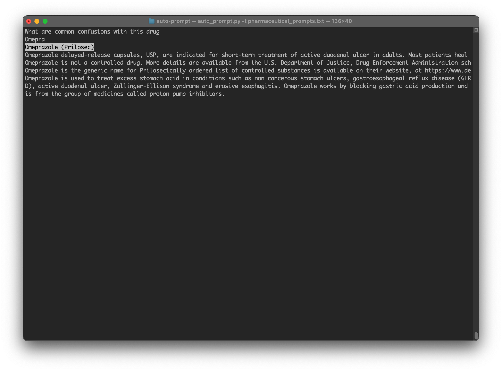

# Auto Prompt: Generative AI Prompt Autocomplete

This Python script builds prompts for generative AI applications. The goal is to make
prompt engineering easier, by using autocomplete when typing prompts. The autocomplete
corpus can be defined by the user.

**NOTE:** Currently only US English keyboard inputs are supported



**Contents**
1. [Installation](#1-installation)
2. [Usage](#2-usage)
3. [Prompt Structure](#3-prompt-structure)
4. [Pharmaceutical Prompts Example](#4-pharmaceutical-prompts-example)
5. [Responsible Use of Data](#5-responsible-use-of-data)
6. [Design Notes / Suggested Improvements](#6-design-notes--suggested-improvements)
7. [References](#7-references)

## 1. Installation
This program is designed to run in a Unix based shell environment; I.E., Linux flavors, MacOS, Cygwin, etc.
* Clone the repo
* Navigate to the home directory of the repo
* [optional] use a Python virtual environment:

    ```
    python3 -m venv env
    source env/bin/activate
    ```

* Install required Python modules:

  ```
  pip install -r requirements.txt 
  ```

## 2. Usage
* Navigate to the home directory of the repo
* Run the program with an argument containing the included autocomplete dictionary:

  ```
  export $TRAINING_FILE=pharmaceutical_prompts.txt
  ./auto_prompt.py -t $TRAINING_FILE
  ```

* Use argument `-h` or `--help` for help

  ```
  ./auto_prompt.py --help
  ```

## 3. Prompt Structure
Please see the below table for the prompt structure used with the Auto Prompt tool:
* The header row has the components of a prompt, written order from left to right

  **NOTE:** In most generative AI prompts, these components are commonly written in separate lines, for human readability

* The second row describes the purpose of each prompt component
* The last row gives an example of each prompt component, taken from the included example prompts in [pharmaceutical_prompts.txt](./pharmaceutical_prompts.txt)


|Request|Key|Formats|Framing|Shots|
|-------|---|-------|-------|-----|
|The main body of the prompt|The most important word or phrase in the body of the prompt|Specific attributes that the user wants the bot to output|Context or a description of the problem|Example answer content and structure|
|What should a patient know about this drug|Omeprazole (Prilosec)|college level English|I am a pharmacist doing patient consults|Omeprazole is used to treat excess stomach acid in conditions such as non cancerous stomach ulcers, gastroesophageal reflux disease (GERD), active duodenal ulcer, Zollinger-Ellison syndrome and erosive esophagitis. Omeprazole works by blocking gastric acid production and is from the group of medicines called proton pump inhibitors.|

## 4. Pharmaceutical Prompts Example
Included in this repo is a corpus of example prompts, specific to the pharmaceutical industry:
[pharmaceutical_prompts.txt](./pharmaceutical_prompts.txt).

## 5. Responsible Use of Data
The key component of the Auto Prompt tool is actually the corpus of example prompts. Every effort should be made to acquire accurate data from an accountable source. Even more importantly, credit should be given to the providers of the data. The example prompts included in [pharmaceutical_prompts.txt](./pharmaceutical_prompts.txt) were sourced from the entities listed in the below [References](#5-references)
section.

## 6. Design Notes / Suggested Improvements
* Add code to allow using a .csv file as the autocomplete dictionary, not just a .txt one
* Most of the time was spent on preparing the industry-specific corpus of example prompts
* It would be easier to just find a text editor that allows adding a custom dictionary for its native autocomplete feature

## 7. References
* https://docs.python.org/3/howto/curses.html
* [Prompt Structure in Conversations with Generative AI](https://www.nngroup.com/articles/ai-prompt-structure/)
* [ClinCalc.com](https://clincalc.com)'s [Top 250 Pharmaceutical Drugs](https://clincalc.com/Downloads/Top250Drugs-DrugList.pdf)
* [Drugs.com](https://www.drugs.com), for drug interactions
* [McKesson Corporation](https://www.mckesson.com/Pharmaceutical-Distribution/)
* [U.S. Department of Justice, Drug Enforcement Administration](https://www.deadiversion.usdoj.gov/schedules/)
* [FDA List of Authorized Generic Drugs](https://www.fda.gov/drugs/abbreviated-new-drug-application-anda/fda-list-authorized-generic-drugs)